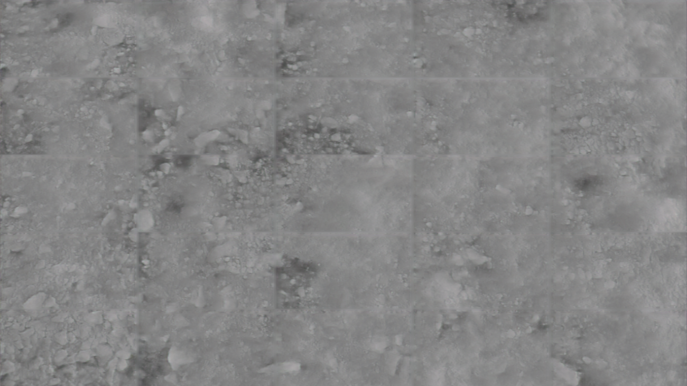

# Texture Splitter AI

Made by Asger Suhr Langhoff

## Overview

Texture Splitter AI is a Generative Adversarial Network (GAN), discovered
by Ian Goodfellow in 2014. It's able to generate textures from a single input
image. It's able to do this because it has looked on thousands of images of
normal maps, height maps, diffuse maps and so on. From what it has seen in the
past it's able to generate a prediction of textures from any kind of input image.

## How to use it

It's fairly straightforward to use, once it's installed.
just navigate to blenders shader editor, and open the sidebar (hotkey: "n")
and click the tab "Texture Splitter AI" and the button "Load AI"

A new window will pop up, and here you can click the load Image button.
Select your desired image, and click the "generate textures" button.
The time it takes to generate textures depends on your image size, and you graphics card.

## How does it work?

The program splits input image to squares of 256x256. This is simply
because it's too heavy to run the AI on larger images (like 4k images).
It will freeze your computer (trust me, I've tried). Then once it's done
with all the "patches" of your image, I use another AI to stitch them
together again. "Why use another AI?" I hear you ask. Well my curious friend,
it's simply because if I just put the patches back together, the image will look tiled.
Reason is, there might be slight differences between the results of each patch
and then the border will of each patch will be visible.

## Tips and tricks

+ The addon will accept UV maps. The way it handles is by inpainting.
This means If you load an image with an alpha channel, it will try and
paint in the empty area with a nearest neighbor algorithm.

+ sometimes you will encounter that the normal map direction is wrong.
Just seperate the RGB channels invert R and G and merge them back together again
